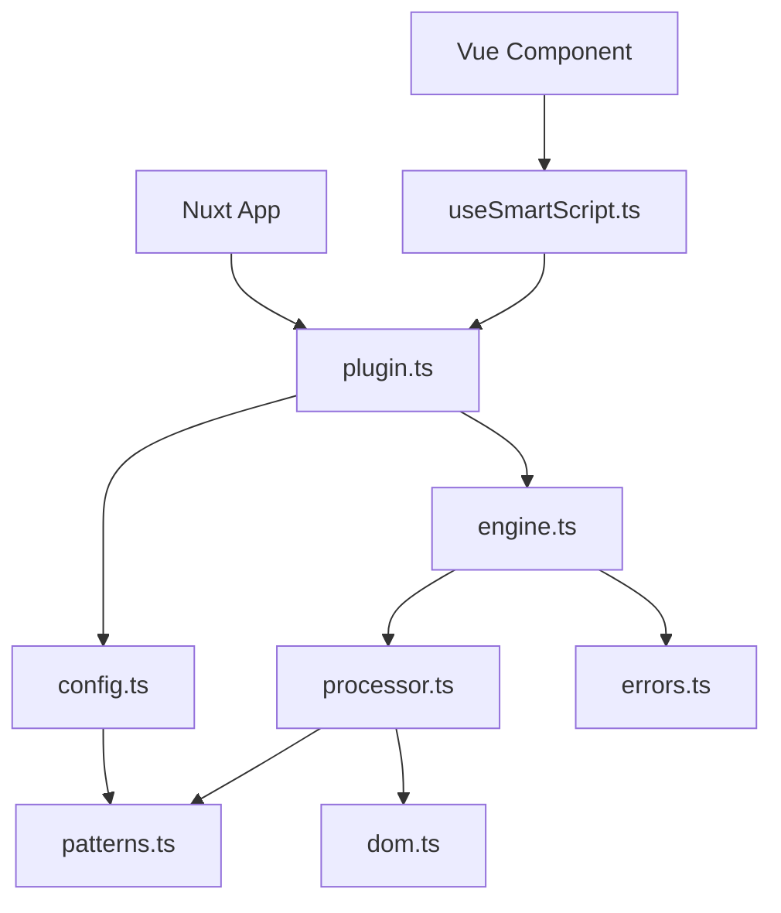

# Architecture

## Overview

The nuxt-smartscript module follows a modular, separation-of-concerns architecture designed for maintainability, testability, and extensibility. The codebase is organized into focused modules, each responsible for a specific aspect of the typography transformation system.

## Module Structure

```
src/runtime/
├── plugin.ts                 # Main orchestrator
├── composables/
│   └── useSmartScript.ts    # Vue composable API
└── smartscript/
    ├── types.ts             # TypeScript interfaces
    ├── config.ts            # Configuration management
    ├── patterns.ts          # Regex patterns & matchers
    ├── processor.ts         # Text processing logic
    ├── dom.ts               # DOM manipulation
    ├── engine.ts            # Processing engine
    ├── errors.ts            # Error handling
    └── index.ts             # Public API exports
```

## Core Modules

### `plugin.ts` - Main Orchestrator
**Responsibility:** Integrates the module with Nuxt, manages lifecycle hooks, and provides the public API.

```typescript
// Key responsibilities:
- Initialize configuration from runtime config
- Set up client-side processing hooks
- Create and manage MutationObserver
- Provide $smartscript API to Nuxt app
- Handle navigation and route changes
```

**When to modify:** When adding new Nuxt hooks, API methods, or changing initialization flow.

### `types.ts` - Type Definitions
**Responsibility:** Central location for all TypeScript interfaces and type definitions.

```typescript
export interface SuperscriptConfig {
  symbols: SymbolConfig
  selectors: SelectorConfig
  performance: PerformanceConfig
  positioning?: PositioningConfig
}

export interface TextPart {
  type: 'text' | 'super' | 'sub'
  content: string
}
```

**When to modify:** When adding new configuration options or data structures.

### `config.ts` - Configuration Management
**Responsibility:** Default configuration, validation, and merging user configs.

```typescript
export const DEFAULT_CONFIG: SuperscriptConfig = {
  symbols: {
    trademark: ['™', '(TM)', 'TM'],
    registered: ['®', '(R)'],
    // ...
  }
}

export function mergeConfig(userConfig: Partial<SuperscriptConfig>): SuperscriptConfig
export function validateConfig(config: SuperscriptConfig): string[]
```

**When to modify:** When adding new configuration defaults or validation rules.

### `patterns.ts` - Pattern Management
**Responsibility:** Regex patterns and pattern matching utilities.

```typescript
export function createPatterns(config: SuperscriptConfig): PatternSet {
  return {
    trademark: /™|\(TM\)|\bTM\b/g,
    registered: /®|\(R\)(?!\))/g,
    ordinals: /\b(\d+)(st|nd|rd|th)\b/g,
    // ...
  }
}

export const PatternMatchers = {
  isTrademark: (text: string): boolean => /^(™|\(TM\)|TM)$/.test(text),
  isRegistered: (text: string): boolean => /^(®|\(R\))$/.test(text),
  // ...
}
```

**When to modify:** When adding new text patterns to detect and transform.

### `processor.ts` - Text Processing
**Responsibility:** Core logic for transforming matched text into structured parts.

```typescript
export function processMatch(matched: string): ProcessingResult {
  if (PatternMatchers.isTrademark(matched)) {
    return {
      modified: true,
      parts: [{ type: 'super', content: '™' }]
    }
  }
  // ... handle other patterns
}

export function processTextNode(textNode: Text, config, patterns): boolean
```

**When to modify:** When changing how matches are transformed or adding new transformation logic.

### `dom.ts` - DOM Utilities
**Responsibility:** DOM element creation and manipulation.

```typescript
export function createElement(part: TextPart, isHeader: boolean, config): HTMLElement | Text {
  if (part.type === 'super') {
    const sup = document.createElement('sup')
    sup.textContent = part.content
    sup.className = determineClass(part.content)
    // Apply positioning...
    return sup
  }
  // ...
}

export function replaceTextNode(textNode: Text, fragment: DocumentFragment): void
```

**When to modify:** When changing DOM element creation, styling, or attributes.

### `engine.ts` - Processing Engine
**Responsibility:** Orchestrates the processing flow, manages batching and performance.

```typescript
export function processContent(config, patterns, combinedPattern): void {
  const elements = document.querySelectorAll(config.selectors.include.join(', '))
  elements.forEach(element => processElement(element, config, patterns, combinedPattern))
}

export function createContentObserver(processCallback, config): MutationObserver
```

**When to modify:** When changing the processing flow, batching logic, or observer behavior.

### `errors.ts` - Error Handling
**Responsibility:** Error recovery and graceful degradation.

```typescript
export class SmartScriptError extends Error {
  constructor(message: string, public readonly code: string) {
    super(message)
    this.name = 'SmartScriptError'
  }
}

export function handleProcessingError(error: Error, context: string): void
```

**When to modify:** When adding new error types or changing error handling strategy.

### `index.ts` - Public API
**Responsibility:** Exports the public API surface for the module.

```typescript
// Re-export public APIs
export { DEFAULT_CONFIG, mergeConfig } from './config'
export { createPatterns, PatternMatchers } from './patterns'
export { processContent } from './engine'
export type { SuperscriptConfig, TextPart } from './types'
```

**When to modify:** When exposing new public APIs or types.

## Data Flow



## Processing Pipeline

1. **Initialization**
   - Plugin loads configuration
   - Creates regex patterns
   - Sets up MutationObserver

2. **Content Detection**
   - TreeWalker traverses DOM
   - Text nodes tested against patterns
   - Matching nodes queued for processing

3. **Text Processing**
   - Matched text analyzed by processor
   - Broken into typed parts (text/super/sub)
   - Parts validated and structured

4. **DOM Manipulation**
   - Document fragment created
   - Elements built from parts
   - Original text node replaced

5. **Performance Optimization**
   - Processing debounced (100ms)
   - Batched updates (50 nodes)
   - Hydration delay (1500ms)

## Extension Points

### Adding a New Pattern

1. **Define Pattern** (`patterns.ts`):
```typescript
fractions: /\b(\d+)\/(\d+)\b/g
```

2. **Add Matcher** (`patterns.ts`):
```typescript
isFraction: (text: string): boolean => /^\d+\/\d+$/.test(text)
```

3. **Process Match** (`processor.ts`):
```typescript
if (PatternMatchers.isFraction(matched)) {
  const [num, denom] = matched.split('/')
  return {
    modified: true,
    parts: [
      { type: 'super', content: num },
      { type: 'text', content: '⁄' },
      { type: 'sub', content: denom }
    ]
  }
}
```

4. **Style Elements** (`dom.ts`):
```typescript
if (part.content.includes('⁄')) {
  element.className += ' fraction'
}
```

## Performance Considerations

- **Debouncing:** All processing debounced at 100ms to prevent excessive updates
- **Batching:** Nodes processed in batches of 50 for better performance
- **Lazy Evaluation:** Patterns only compiled when needed
- **Early Exit:** Quick text check before full regex processing
- **TreeWalker:** Efficient DOM traversal with built-in filtering

## Error Recovery

The module implements multiple layers of error recovery:

1. **Configuration Errors:** Falls back to defaults
2. **Processing Errors:** Logs and continues with next node
3. **DOM Errors:** Validates parent existence before replacement
4. **Observer Errors:** Gracefully disables if creation fails

## Testing Strategy

Each module has corresponding tests:

- `patterns.test.ts` - Pattern matching validation
- `processor.test.ts` - Text transformation logic
- `config.test.ts` - Configuration merging/validation
- `dom.test.ts` - DOM manipulation
- `engine.test.ts` - Processing flow

## Security Considerations

- No `innerHTML` usage - prevents XSS
- Text content properly escaped
- User input validated
- Configuration sanitized
- ARIA labels for accessibility