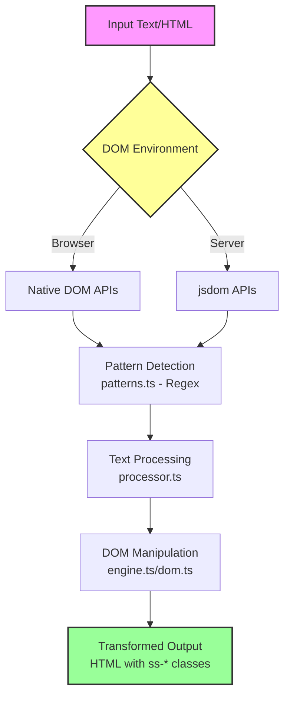

# nuxt-smartscript Architecture

## Overview

nuxt-smartscript is a Nuxt 3 module that performs automatic typography transformations using a unified DOM-based approach for both client-side and server-side rendering (SSR/SSG).

## Core Architecture

### Two Processing Modes

The module operates in two complementary modes:

1. **Client-side Processing** (Browser)
   - Uses native browser DOM APIs
   - Handles dynamic content with MutationObserver
   - Processes content after Vue hydration

2. **Server-side Processing** (SSR/SSG)
   - Uses jsdom to simulate DOM environment
   - Processes during Nuxt's render:html hook
   - Pre-transforms content for static generation

### Unified Processing Pipeline

Both modes share 90% of the same code:



## Key Components

### 1. Pattern Matching (`patterns.ts`)

Defines regex patterns for identifying text to transform:

- **Symbols**: `(TM)` → ™, `(R)` → ®
- **Ordinals**: `1st`, `2nd`, `3rd`, `4th`
- **Chemicals**: `H2O`, `CO2`, `H2SO4`
- **Math**: `x^2` (superscript), `x_1` (subscript)

These patterns are **shared** between client and server.

### 2. Text Processing (`processor.ts`)

Core transformation logic that:
- Takes raw text and pattern regex
- Returns array of TextPart objects
- Handles validation and edge cases
- **Identical** for both client and server

### 3. DOM Manipulation

#### Client-side (`engine.ts`)
```javascript
// Uses native browser APIs
const walker = document.createTreeWalker(
  element,
  NodeFilter.SHOW_TEXT,
  filterFunction
)
```

#### Server-side (`nitro/plugin-jsdom.ts`)
```javascript
// Uses jsdom to provide DOM APIs
const dom = new JSDOM(html)
global.document = dom.window.document
// Now can use same TreeWalker code
```

### 4. Element Creation (`dom.ts`)

Creates the transformed elements:
- `<span class="ss-tm">™</span>` - Positioned symbols
- `<sup class="ss-ordinal">st</sup>` - Semantic superscripts
- `<sub class="ss-chemical">2</sub>` - Semantic subscripts

## Processing Flow

### Development Mode (Client-only)

```
1. Page loads with raw content: "Product(TM)"
2. Vue hydrates the page
3. Plugin waits 1500ms (avoid hydration conflicts)
4. TreeWalker finds text nodes
5. Patterns match "(TM)"
6. Processor creates TextPart array
7. DOM replaced with: "Product<span class="ss-tm">™</span>"
8. MutationObserver watches for new content
```

### Production Mode (SSR + Client)

```
1. Server receives request
2. Nitro plugin hooks render:html
3. jsdom parses HTML string
4. Same processing pipeline runs
5. HTML sent with transformations: "Product<span class="ss-tm">™</span>"
6. Client receives pre-transformed HTML
7. Client skips processing (detects meta tag)
8. MutationObserver still watches for dynamic content
```

### Static Generation (SSG only)

```
1. nuxt generate runs
2. Each route pre-rendered
3. Nitro plugin transforms during generation
4. Static HTML files contain transformations
5. No client processing needed
6. Optimal for SEO and performance
```

## Exclusion System

Both modes respect the same exclusions:

### Element-level Exclusions
- `<pre>` - Code blocks
- `<code>` - Inline code
- `<script>` - JavaScript
- `<style>` - CSS
- `[data-no-superscript]` - Explicit opt-out
- `.no-superscript` - Class-based opt-out

### Context Checking
```javascript
// Client & Server both use this approach
if (element.closest('[data-no-superscript]')) {
  return // Skip processing
}
```

## Performance Optimizations

### Client-side
- **Debouncing**: Batch mutations (100ms default)
- **Batch Processing**: Process 50 nodes at a time
- **Early Exit**: Skip if no patterns match
- **Caching**: Pattern matching results cached

### Server-side
- **Single Pass**: Process during render
- **No Watchers**: Static content doesn't need observation
- **Selective Processing**: Only configured selectors

## Configuration

Unified configuration for both modes:

```typescript
export default defineNuxtConfig({
  smartscript: {
    // Enable/disable processing modes
    ssr: true,        // Server-side processing
    client: true,     // Client-side processing
    
    // Shared pattern configuration
    transformations: {
      trademark: true,
      registered: true,
      ordinals: true,
      chemicals: true,
      mathSuper: true,
      mathSub: true
    },
    
    // Shared selectors
    selectors: {
      include: ['main', 'article', 'section'],
      exclude: ['pre', 'code', '[data-no-superscript]']
    },
    
    // CSS positioning (applied by both modes)
    cssVariables: {
      'tm-top': '-0.4em',
      'reg-top': '-0.4em'
    }
  }
})
```

## Why This Architecture?

### Benefits of Unified Approach

1. **DRY Principle**: Core logic written once, used everywhere
2. **Consistency**: Same transformations regardless of rendering mode
3. **Maintainability**: Fix bugs in one place
4. **Testing**: Test core logic independently of environment

### Benefits of jsdom for SSR

1. **True DOM APIs**: Not regex HTML parsing
2. **Reliable**: Handles complex nested HTML
3. **Compatible**: Same code runs on client and server
4. **Accurate**: Proper handling of exclusions and edge cases

### Trade-offs

- **jsdom dependency**: Adds ~2MB to server bundle
- **Performance**: Slightly slower than regex (worth it for accuracy)
- **Complexity**: More setup code for SSR

## Future Enhancements

Potential improvements while maintaining architecture:

1. **Worker Thread Processing**: Offload to worker for large documents
2. **Streaming SSR**: Process chunks as they render
3. **Smart Caching**: Cache transformed fragments
4. **Custom Elements**: Web Components for transformed content

## Summary

The architecture achieves the goal of "write once, run anywhere" for typography transformations. By using jsdom on the server, we maintain true DOM parity between environments while sharing all business logic. This results in a robust, maintainable system that works consistently across all rendering modes.