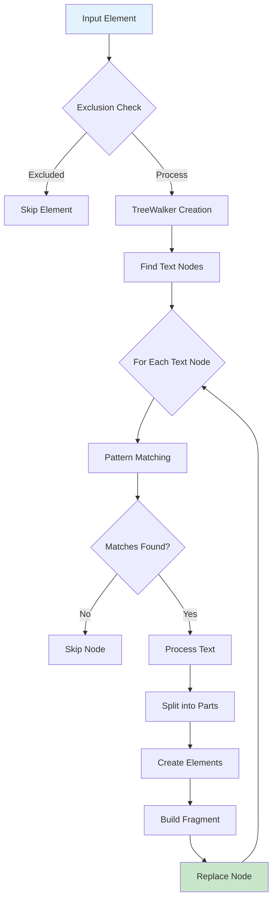
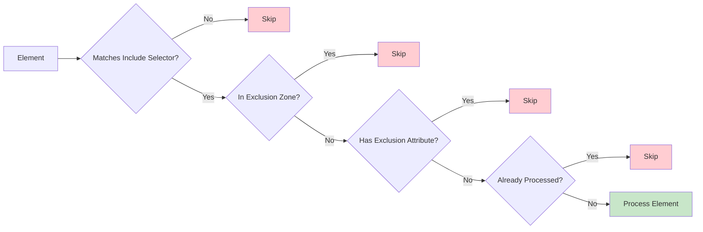
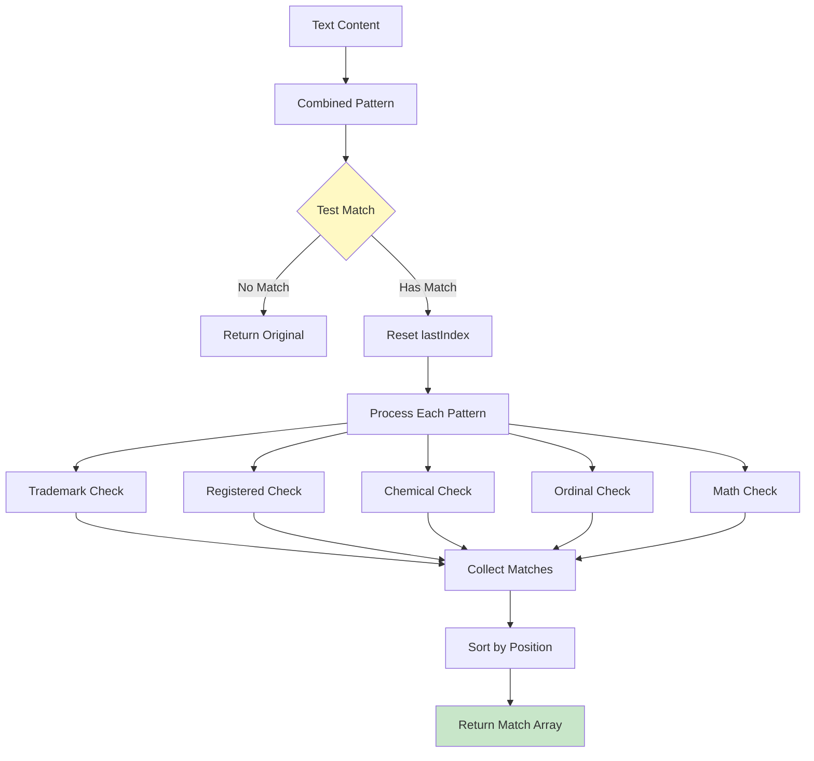
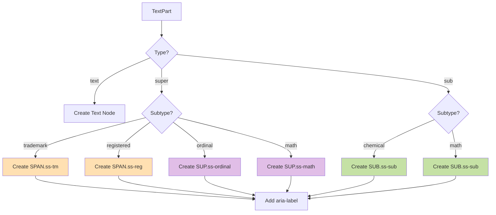
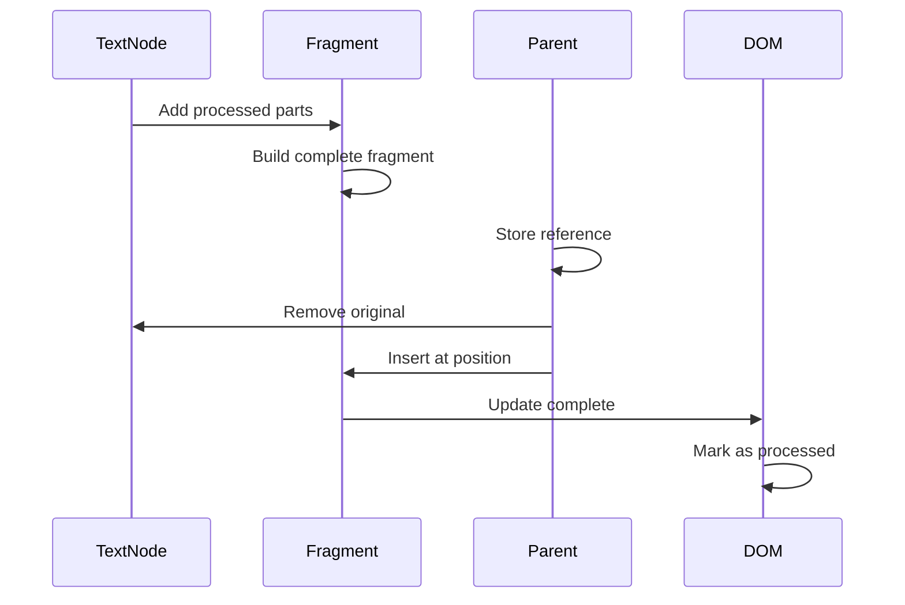
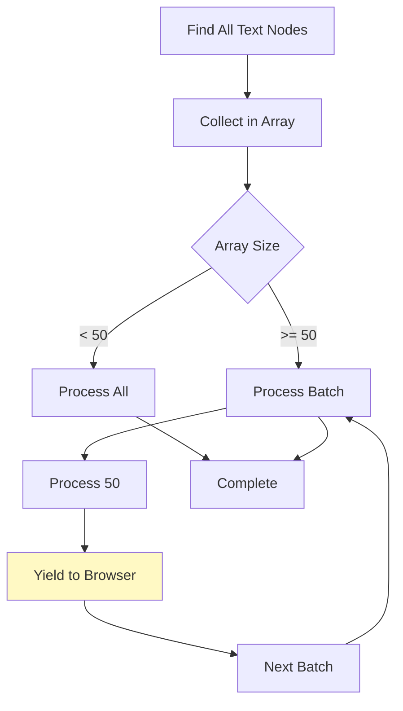
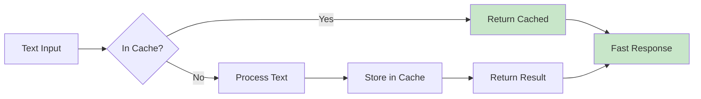
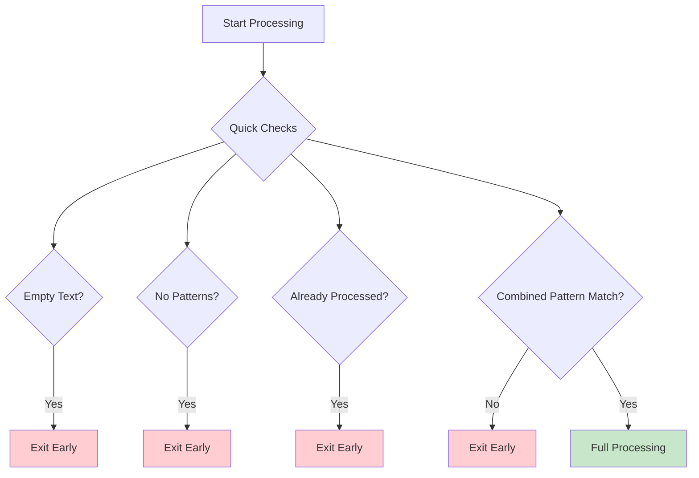
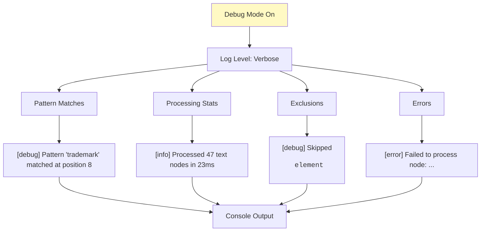
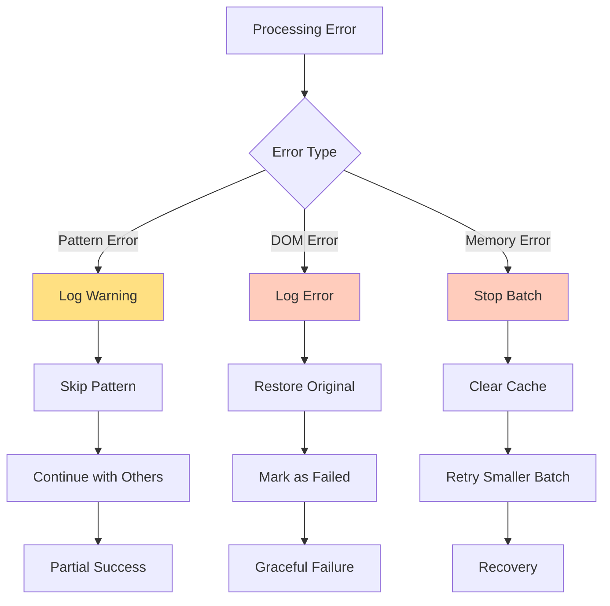

# Processing Architecture

## Overview

This document details how nuxt-smartscript processes text and transforms it into properly formatted typography. The processing pipeline is identical for both client and server, ensuring consistent results.

## The Processing Pipeline



## Detailed Processing Steps

### Step 1: Element Selection and Exclusion



**Exclusion Zones:**
- `<pre>` - Code blocks
- `<code>` - Inline code  
- `<script>` - JavaScript
- `<style>` - CSS
- `[data-no-superscript]` - Explicit opt-out
- `.no-superscript` - Class-based opt-out

### Step 2: Text Node Discovery

```javascript
// TreeWalker configuration
const walker = document.createTreeWalker(
  element,
  NodeFilter.SHOW_TEXT,
  {
    acceptNode(node) {
      // Skip empty nodes
      if (!node.textContent?.trim()) {
        return NodeFilter.FILTER_REJECT
      }
      
      // Skip if parent is already transformed
      if (parent.classList.contains('ss-tm')) {
        return NodeFilter.FILTER_REJECT
      }
      
      // Skip if in exclusion zone
      if (shouldExclude(node)) {
        return NodeFilter.FILTER_REJECT
      }
      
      return NodeFilter.FILTER_ACCEPT
    }
  }
)
```

### Step 3: Pattern Matching



**Pattern Priority Order:**
1. Symbols (™, ®, ©) - Highest priority
2. Ordinals (1st, 2nd) - Common in text
3. Chemicals (H2O, CO2) - Scientific notation
4. Math superscript (x^2) - Mathematical
5. Math subscript (x_n) - Lowest priority

### Step 4: Text Processing

```mermaid
graph LR
    A[Text: "Product(TM) is 1st"] --> B[Process Text]
    
    B --> C[Part 1: "Product"]
    B --> D[Part 2: "™" - symbol]
    B --> E[Part 3: " is 1"]
    B --> F[Part 4: "st" - ordinal]
    
    C --> G[Text Node]
    D --> H[SPAN Element]
    E --> I[Text Node]
    F --> J[SUP Element]
    
    style D fill:#ffecb3
    style F fill:#ffecb3
```

**TextPart Structure:**
```typescript
interface TextPart {
  content: string      // The text content
  type: 'text' | 'super' | 'sub'
  subtype?: 'trademark' | 'registered' | 'ordinal' | 'chemical' | 'math'
  originalLength: number  // For tracking position
}
```

### Step 5: Element Creation



**Element Types:**
- **SPAN** - For positioned symbols (™, ®)
  - Allows `position: relative` for fine control
  - Used for trademark and registered marks
  
- **SUP** - For semantic superscripts
  - Ordinals (1st, 2nd)
  - Math superscripts (x²)
  
- **SUB** - For semantic subscripts  
  - Chemical formulas (H₂O)
  - Math subscripts (xₙ)

### Step 6: DOM Replacement



## Pattern Details

### Symbol Patterns

```mermaid
graph LR
    A["(TM)"] --> B[Match Groups]
    B --> C[Full: "(TM)"]
    C --> D[Transform: "™"]
    D --> E["<span class='ss-tm'>™</span>"]
    
    F["™"] --> G[Direct Match]
    G --> H[Transform: "™"]
    H --> E
    
    style A fill:#e3f2fd
    style F fill:#e3f2fd
    style E fill:#c8e6c9
```

### Chemical Patterns

```mermaid
graph TD
    A["H2O"] --> B[Regex: /([A-Z][a-z]?)(\d+)/g]
    B --> C[Group 1: "H"]
    B --> D[Group 2: "2"]
    B --> E[After: "O"]
    
    C --> F[Keep as text]
    D --> G[Create subscript]
    E --> H[Keep as text]
    
    F --> I["H"]
    G --> J["<sub>2</sub>"]
    H --> K["O"]
    
    I --> L[Result: "H<sub>2</sub>O"]
    J --> L
    K --> L
    
    style A fill:#e3f2fd
    style L fill:#c8e6c9
```

### Math Notation Patterns

```mermaid
graph LR
    subgraph "Superscript"
        A1["x^2"] --> B1[Variable: "x"]
        A1 --> C1[Symbol: "^"]
        A1 --> D1[Exponent: "2"]
        D1 --> E1["<sup>2</sup>"]
    end
    
    subgraph "Subscript"
        A2["x_n"] --> B2[Variable: "x"]
        A2 --> C2[Symbol: "_"]
        A2 --> D2[Index: "n"]
        D2 --> E2["<sub>n</sub>"]
    end
    
    subgraph "LaTeX Braces"
        A3["x_{n+1}"] --> B3[Variable: "x"]
        A3 --> C3[Symbol: "_"]
        A3 --> D3[Expression: "{n+1}"]
        D3 --> E3[Strip braces]
        E3 --> F3["<sub>n+1</sub>"]
    end
```

## Performance Optimizations

### Batch Processing



### Pattern Caching



### Early Exit Strategies



## Debugging and Logging



## Error Recovery



## Integration Points

### Client-Side Integration

```javascript
// Vue integration
app.config.globalProperties.$smartscript = {
  process: (element) => engine.processElement(element),
  refresh: () => engine.processAll(),
  disable: () => engine.stop(),
  enable: () => engine.start()
}
```

### Server-Side Integration

```javascript
// Nitro hook integration
nitro.hooks.hook('render:html', (html, { event }) => {
  const config = event.context.$config.public.smartscript
  const processed = processWithJsdom(html, config)
  return processed
})
```

### Configuration Integration

```javascript
// Runtime config merge
const finalConfig = {
  ...defaultConfig,
  ...userConfig,
  transformations: {
    ...defaultConfig.transformations,
    ...userConfig.transformations
  }
}
```