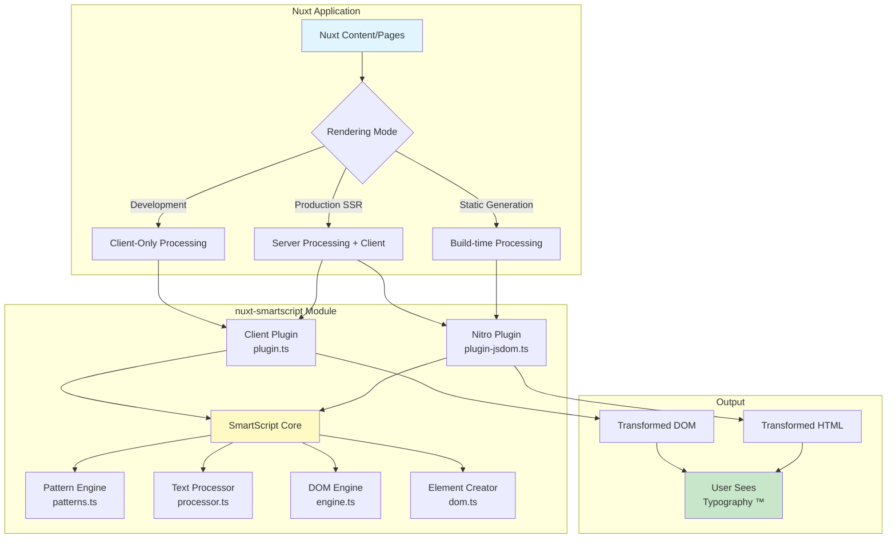
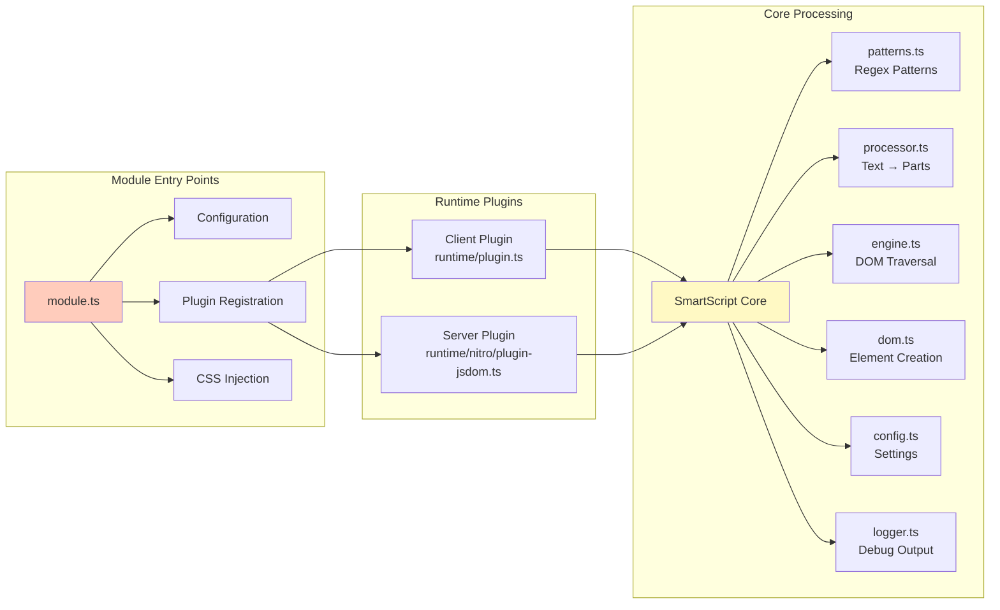
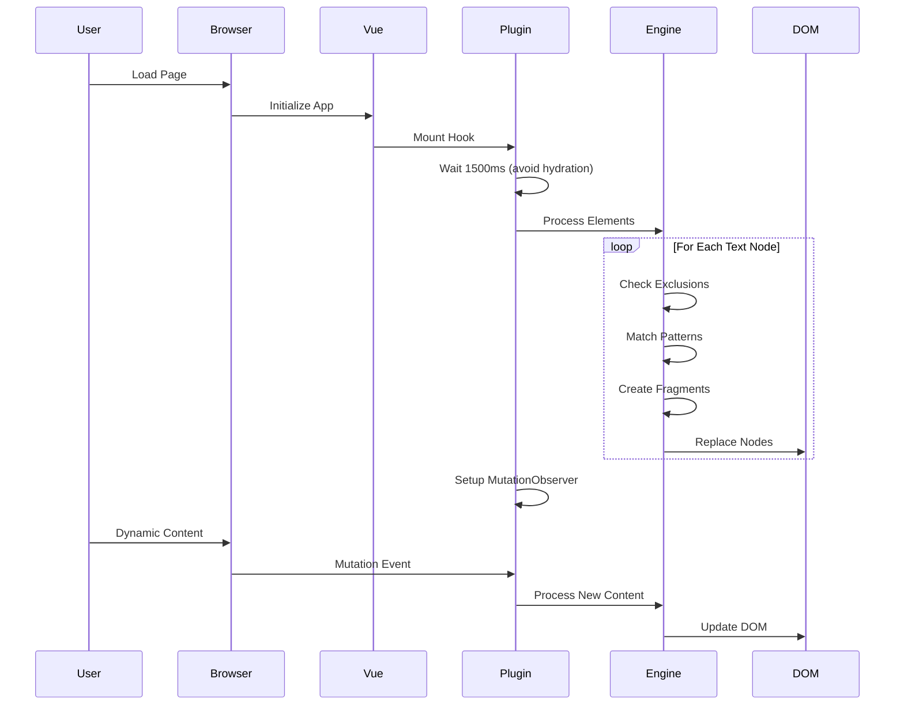
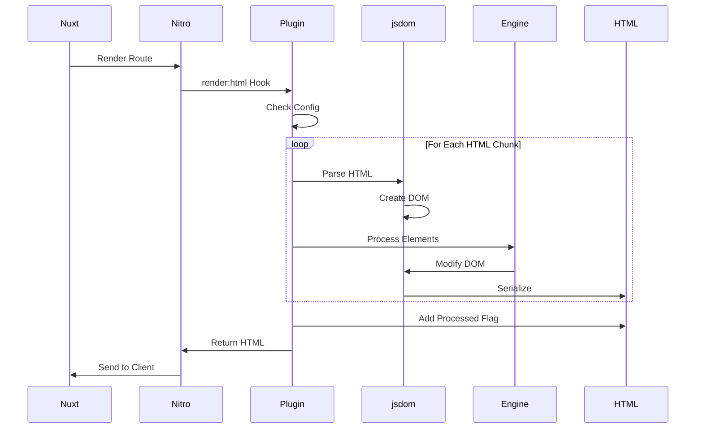
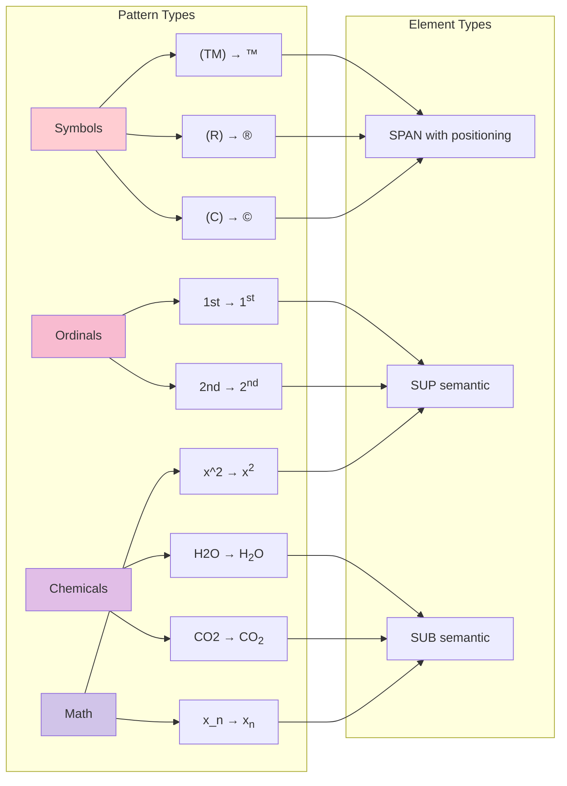
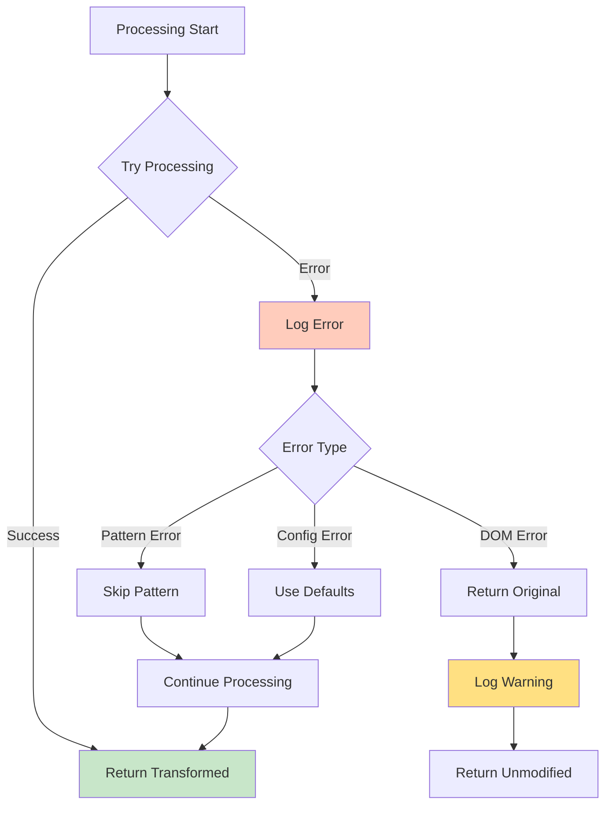
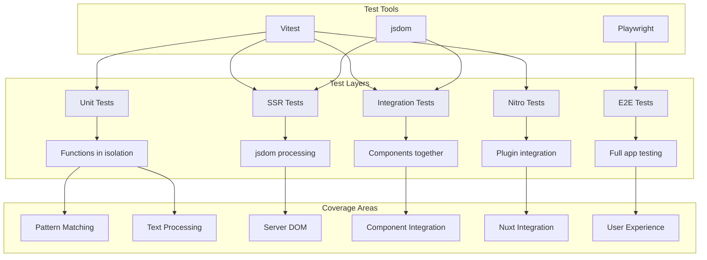
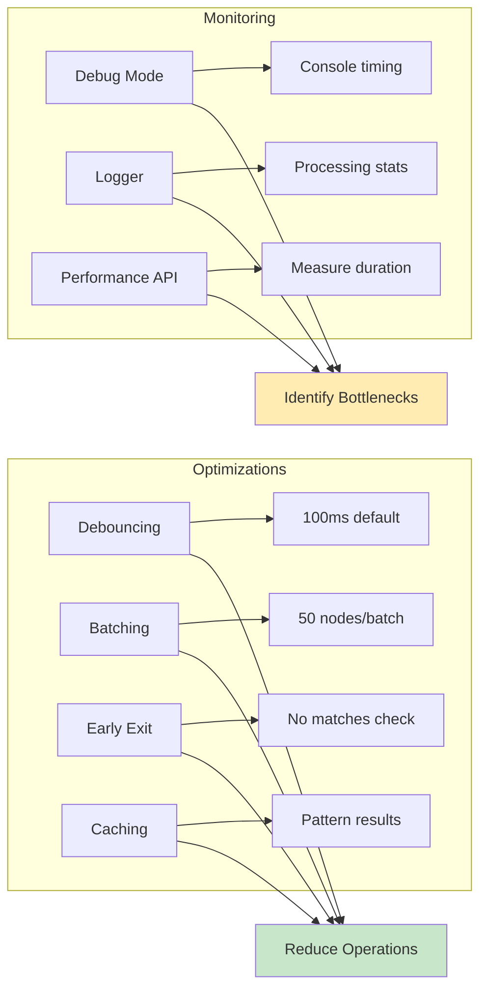

# System Architecture

## High-Level Overview

nuxt-smartscript is a Nuxt 3 module that provides automatic typography transformations for both client-side and server-side rendering environments.



## Component Architecture



## Processing Flow

### Client-Side Processing



### Server-Side Processing (SSR/SSG)



## Data Flow

```mermaid
graph TD
    subgraph "Input"
        A[Raw Text: "Product(TM)"]
    end
    
    subgraph "Pattern Matching"
        A --> B[Regex: /™|\(TM\)/g]
        B --> C{Match Found?}
        C -->|Yes| D[Create TextPart]
        C -->|No| E[Skip]
    end
    
    subgraph "Processing"
        D --> F[Determine Type]
        F -->|Symbol| G[Create SPAN]
        F -->|Super| H[Create SUP]
        F -->|Sub| I[Create SUB]
    end
    
    subgraph "Output"
        G --> J["<span class='ss-tm'>™</span>"]
        H --> K["<sup class='ss-ordinal'>st</sup>"]
        I --> L["<sub class='ss-sub'>2</sub>"]
    end
    
    style A fill:#e3f2fd
    style J fill:#c8e6c9
    style K fill:#c8e6c9
    style L fill:#c8e6c9
```

## Configuration Flow

```mermaid
graph TD
    A[nuxt.config.ts] --> B[Module Options]
    B --> C[Runtime Config]
    
    C --> D{Environment}
    D -->|Client| E[Plugin reads config]
    D -->|Server| F[Nitro reads config]
    
    E --> G[mergeConfig()]
    F --> G
    
    G --> H[Default Config]
    G --> I[User Config]
    H --> J[Merged Config]
    I --> J
    
    J --> K[createPatterns()]
    K --> L[Pattern Set]
    
    J --> M[CSS Variables]
    M --> N[Runtime Styles]
    
    style A fill:#ffecb3
    style J fill:#c5e1a5
```

## Deployment Architecture

```mermaid
graph TB
    subgraph "Development"
        A[npm run dev] --> B[Vite Dev Server]
        B --> C[Client-Only Mode]
        C --> D[Hot Module Reload]
    end
    
    subgraph "Production SSR"
        E[npm run build] --> F[Nitro Build]
        F --> G[Server Bundle]
        F --> H[Client Bundle]
        G --> I[Node.js Server]
        H --> I
        I --> J[SSR + Hydration]
    end
    
    subgraph "Static Generation"
        K[npm run generate] --> L[Nitro Prerender]
        L --> M[Process All Routes]
        M --> N[Static HTML Files]
        N --> O[CDN/GitHub Pages]
    end
    
    style C fill:#fff3e0
    style J fill:#e8f5e9
    style O fill:#e1f5fe
```



## Pattern Types and Transformations



## Error Handling



## Testing Architecture



## Performance Considerations



## Security Considerations

```mermaid
graph TD
    A[Input HTML/Text] --> B{Validation}
    B --> C[DOM APIs Only]
    C --> D[No innerHTML]
    C --> E[No eval()]
    C --> F[Text Content Only]
    
    D --> G[XSS Prevention]
    E --> G
    F --> G
    
    B --> H[Exclusion Zones]
    H --> I[Skip script tags]
    H --> J[Skip style tags]
    H --> K[Skip pre/code]
    
    I --> L[Safe Processing]
    J --> L
    K --> L
    
    G --> M[Secure Output]
    L --> M
    
    style A fill:#ffcdd2
    style G fill:#c8e6c9
    style M fill:#c8e6c9
```